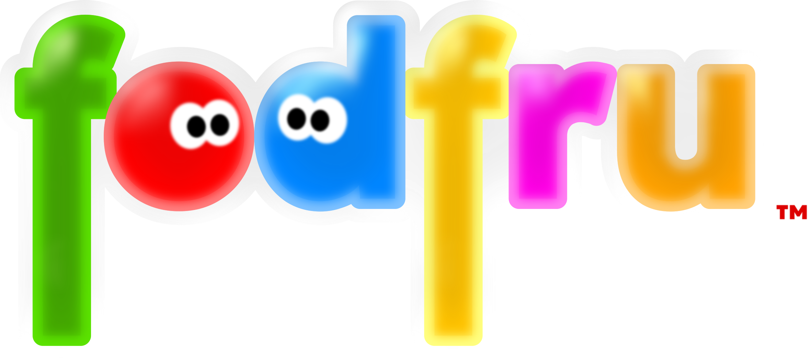

 
3D platformer video game developed by Néo Foderé de Frutos under the name NSTUDIOS GAMES™, a division of FODSOFT™.
[Itch page](https://nsg-fodsoft.itch.io/fodfru)
# Description
FodFru™ is a 3D platformer video game developed by Néo Foderé de Frutos under the name NSTUDIOS GAMES™, a division of FODSOFT™.
In this game, you step into the shoes of the fodfrus, a spherical-shaped alien species that can change color at will. This species is building an amusement park inspired by planet Earth. The problem is that several parts are missing from the main attraction’s mechanism, so your fodfru is one of the chosen ones tasked with finding the remaining pieces to complete the final ride and open the park.

**FodFru™ and all related titles and logos are trademarks of FODSOFT™, NSTUDIOS GAMES™. Néo Foderé de Frutos. All rights reserved. 
© 2025 FODSOFT™, NSTUDIOS GAMES™. Néo Foderé de Frutos. All rights reserved.**
